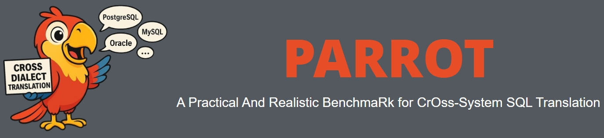

# 🦜 PARROT

<!-- Provide a quick summary of the dataset. -->



PARROT (**P**ractical **A**nd **R**ealistic Benchma**R**k for Cr**O**ss-System SQL **T**ranslation) was created to support the task of Cross-System SQL Translation (i.e., SQL-to-SQL translation), 
which involves adapting a query written for one database system into its functionally equivalent form for another. 
The main dataset comprises 598 translation pairs from 38 open-source benchmarks and real-world business services, 
specifically prepared to challenge system-specific SQL understanding.

## 📂 1. Dataset Details

### 1.1 Dataset Description

<!-- Provide a longer summary of what this dataset is. -->

- **Curated by:** Shanghai Jiao Tong University, Tsinghua University, and Bytedance Team.
- **Language(s) (NLP):** Different dialects with SQL adhering to the standards of PostgreSQL, Oracle, MySQL etc.
- **License:** This project is released under the MIT license. 

### 1.2 Dataset Sources

<!-- Provide the basic links for the dataset. -->

PARROT is constructed based on a collection of open-source SQL-related benchmarks and workloads from real world business service.
The following table presents the details of the collected open-source benchmarks in PARROT, highlighting their sources, dialect coverage, and key statistics.

| Benchmark         | Year | SQL Dialects       | Language          | Domain Type      | Turn Round    | Collection            |
|-------------------|:------:|:------------------------------:|:-------------------:|:------------------:|:---------:|:-----------------------:|
| ATIS              | 1994 | SQLite, MySQL                | English           | Single-domain    | Single  | Manual                |
| GeoQuery          | 1996 | MySQL, SQLite                | English           | Single-domain    | Single  | Manual                |
| Restaurants       | 2000 | SQLite                       | English           | Single-domain    | Single  | Manual                |
| Academic          | 2014 | *Unspecified*                | English           | Single-domain    | Single  | Manual                |
| IMDb              | 2017 | *Unspecified*                | English           | Single-domain    | Single  | Manual                |
| Yelp              | 2017 | *Unspecified*                | English           | Single-domain    | Single  | Manual                |
| Scholar           | 2017 | *Unspecified*                | English           | Single-domain    | Single  | Manual                |
| WikiSQL           | 2017 | SQLite                      | English           | Cross-domain     | Single  | Manual                |
| Advising          | 2018 | SQLite, MySQL                | English           | Single-domain    | Single  | Manual                |
| Spider            | 2018 | SQLite                       | English           | Cross-domain     | Single  | Manual                |
| SParC             | 2019 | SQLite                       | English           | Cross-domain     | Multiple| Manual                |
| CoSQL             | 2019 | SQLite                       | English           | Cross-domain     | Multiple| Manual                |
| CSpider           | 2019 | SQLite                       | Chinese           | Cross-domain     | Single  | Manual                |
| MIMICSQL          | 2020 | SQLite                       | English           | Single-domain    | Single  | Hybrid†               |
| SQUALL            | 2020 | SQLite                       | English           | Cross-domain     | Single  | Manual                |
| FIBEN             | 2020 | IBM Db2, PostgreSQL              | English           | Single-domain    | Single  | Manual                |
| ViText2SQL        | 2020 | General SQL                  | Vietnamese        | Cross-domain     | Single  | Manual                |
| DuSQL             | 2020 | *Unspecified*                | Chinese           | Cross-domain     | Single  | Hybrid†               |
| PortugueseSpider  | 2021 | SQLite                       | Portuguese        | Cross-domain     | Single  | Hybrid†               |
| CHASE             | 2021 | SQLite                       | Chinese           | Cross-domain     | Multiple| Manual                |
| Spider-Syn        | 2021 | SQLite                       | English           | Cross-domain     | Single  | Manual                |
| Spider-DK         | 2021 | SQLite                       | English           | Cross-domain     | Single  | Manual                |
| Spider-Realistic  | 2021 | SQLite                       | English           | Cross-domain     | Single  | Manual                |
| KaggleDBQA        | 2021 | SQLite                       | English           | Cross-domain     | Single  | Manual                |
| SEDE              | 2021 | T-SQL                        | English           | Single-domain    | Single  | Manual                |
| MT-TEQL           | 2021 | SQLite                       | English           | Cross-domain     | Single  | Automatic             |
| PAUQ              | 2022 | SQLite                       | Russian           | Cross-domain     | Single  | Manual                |
| knowSQL           | 2022 | *Unspecified*                | Chinese           | Cross-domain     | Single  | Manual                |
| Dr.Spider         | 2023 | SQLite                       | English           | Cross-domain     | Single  | Hybrid†               |
| BIRD              | 2023 | SQLite                       | English           | Cross-domain     | Single  | Manual                |
| AmbiQT            | 2023 | SQLite                       | English           | Cross-domain     | Single  | LLM-aided             |
| ScienceBenchmark  | 2024 | General SQL                  | English           | Single-domain    | Single  | Hybrid†               |
| BookSQL           | 2024 | SQLite                       | English           | Single-domain    | Single  | Manual                |
| Archer            | 2024 | SQLite                       | English/ Chinese  | Cross-domain     | Single  | Manual                |
| BULL              | 2024 | SQLite                       | English/ Chinese  | Single-domain    | Single  | Manual                |
| Spider2           | 2024 | SQLite, DuckDB, PostgreSQL   | English           | Cross-domain     | Single  | Manual                |
| TPC-H FROID       | 2018 | T-SQL, PostgreSQL            | English           | Cross-domain     | Single  | Hybrid†               |
| DSB               | 2021 | T-SQL, PostgreSQL            | English           | Decision Support | Single  | Hybrid†               |
| TPC-DS            | 2005 | T-SQL, PostgreSQL            | English           | Decision Support | Single  | Hybrid†               |
| SQL-ProcBench     | 2021 | SQL Server, PostgreSQL, IBM Db2 | English       | Single-domain | Single | Production-derived |

† **Hybrid** means the dataset was created using both automatic generation and manual annotation.

## ⚙️ 2. Uses

<!-- Address questions around how the dataset is intended to be used. -->

### 2.1 Direct Use

<!-- This section describes suitable use cases for the dataset. -->

PARROT supports direct in various manners.
Below, we showcase how to load it with `datasets` library.

```
from datasets import load_dataset

# Login using e.g. `huggingface-cli login` to access this dataset
ds = load_dataset("weizhoudb/PARROT")
```

## 🧩 3. Dataset Creation

### 3.1 Curation Rationale

<!-- Motivation for the creation of this dataset. -->

PARROT intends to construct a realistic and challenging benchmark for evaluating cross-dialect SQL translation. 
The collected queries pass through a rigorous curation pipeline that retains only those queries satisfying Jim Gray’s four benchmark design principles.

- **(1) Relevance:** PARROT covers a wide range of cross-system SQL translation cases, including different operator complexities. 
- **(2) Simplicity:** PARROT is designed to eliminate redundant SQLs and be easily understandable.
- **(3) Portability:** PARROT is applicable to different translation scenarios (e.g., with different source / target data systems).
- **(4) Scalability:** PARROT includes real datasets of different data sizes and distributions, allowing it to simulate various incoming data sizes and changing patterns.

### 3.2 Annotation process

<!-- This section describes the annotation process such as annotation tools used in the process, the amount of data annotated, annotation guidelines provided to the annotators, interannotator statistics, annotation validation, etc. -->

The annotation process combines automated transformation with manual validation to ensure the accuracy and functional equivalence of SQL translations. 

First, SQL queries from various benchmarks and real-world services are anonymized at the entity, field, and query levels to remove sensitive information while preserving structure.
Next, candidate translations are generated using a combination of rule-based translation tools and LLM-assisted methods. 
Each translation is then manually reviewed and, if necessary, corrected by experienced annotators to ensure that it adheres to the syntax of the target dialect and preserves the semantics of the source query.
Finally, all annotated pairs are validated through execution tests (when applicable) and heuristic checks to confirm correctness across dialects.

## 📖 4. Citation

<!-- If there is a paper or blog post introducing the dataset, the APA and Bibtex information for that should go in this section. -->

If you like this project, please cite our paper:

```
@article{zhou2025cracksql,
  author       = {Wei Zhou and
                  Yuyang Gao and
                  Xuanhe Zhou and
                  Guoliang Li},
  title        = {{Cracking SQL Barriers:} {An}  LLM-based Dialect Transaltion System},
  journal      = {Proc. {ACM} Manag. Data},
  volume       = {3},
  number       = {3 (SIGMOD)},
  year         = {2025}
}

@article{zhou2025cracksqldemo,
  author       = {Wei Zhou and
                  Yuyang Gao and
                  Xuanhe Zhou and
                  Guoliang Li},
  title        = {CrackSQL: A Hybrid SQL Dialect Translation System Powered by Large Language Models},
  journal      = {arXiv Preprint},
  url       = {https://arxiv.org/abs/2504.00882},
  year         = {2025}
}
```

## 📞 5. Dataset Card Contact

If you have any issue, please contact `weizhoudb@sjtu.edu.cn`.