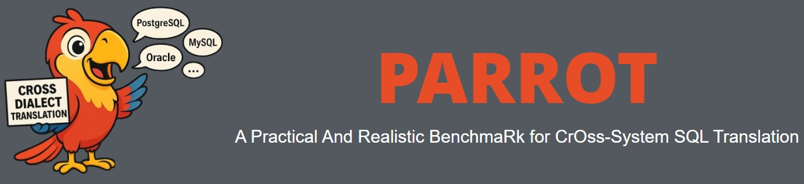
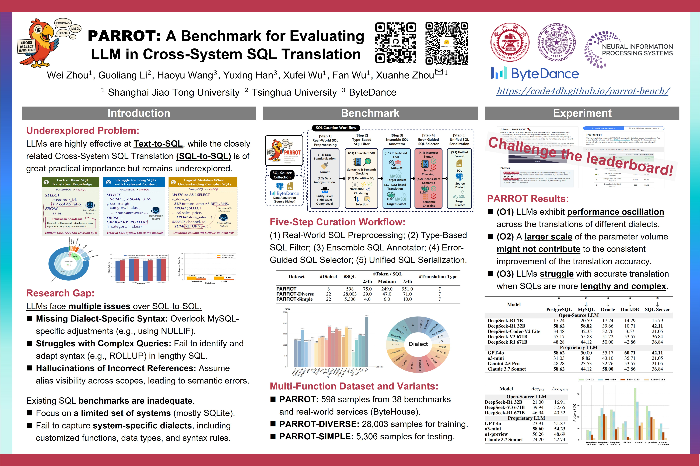

<div align="center">

# 🦜 PARROT

**Practical And Realistic BenchmaRk for crOss-system SQL Translation**

[](https://code4db.github.io/parrot-bench/)
[](https://code4db.github.io/parrot-bench/)
[](https://code4db.github.io/parrot-bench/)
[](https://www.python.org/)
[](LICENSE)



**The first comprehensive benchmark for evaluating cross-system SQL translation systems**

[Leaderboard](https://code4db.github.io/parrot-bench/) • [Documentation](#-benchmark-contents) • [Submit Results](#-submissions) • [Paper](#-citation)

---

</div>

## 📢 News
> - **09/2025:** Our paper "PARROT: A Benchmark for Evaluating LLMs in Cross-System SQL Translation" has been accepted by [NeurIPS 2025](https://neurips.cc/virtual/2025/loc/san-diego/poster/121388)! :tada: :tada: :tada:
> - **05/2025:** We have released PARROT-1.0 (28,003 translation pairs from 38 open-source benchmarks for extensive syntax testing) and published the leaderboard.

---

## ✨ Key Features



<div align="center">

| 🎯 **Comprehensive** | 🔧 **Production-Ready** | 🧪 **Well-Tested** | 🌐 **Multi-Dialect** |
|:---:|:---:|:---:|:---:|
| 598 curated pairs from 38+ benchmarks | Real-world workloads & production data | Built-in validators & parsers | 10+ SQL dialects supported |

</div>

### 🌟 Why PARROT?

- ✅ **598 Translation Pairs** from 38+ public benchmarks and production-derived workloads
- 🧠 **Broad Dialect Coverage**: PostgreSQL, MySQL, SQLite, Oracle, SQL Server, Db2, DuckDB, Trino, Hive, Snowflake, and more
- 🧪 **Built-in Validators**: Comprehensive parsers and executability checks for multiple engines
- 🛠️ **Complete Toolkit**: Preprocessing utilities and baseline translation tools included
- 📊 **Rigorous Evaluation**: Multi-dimensional scoring (syntax and execution)
- 🏆 **Live Leaderboard**: Track your progress and compete with the community

---

## 📤 Submissions

<div align="center">

### 🏆 Ready to compete? Submit your system now!

[](https://code4db.github.io/parrot-bench/)

</div>

### Submission Process

<<<<<<< HEAD
1. **📋 Prepare Outputs**
   - Follow the example in `Submission_Example/20250928_LLMTranslator_ExampleTeam.zip`
   - Ensure proper folder structure and file formats
=======
<p align="center">
  <!-- <a href="#-features">Features</a> • -->
  <a href="https://code4db.github.io/parrot-bench/">LeaderBoard</a>
</p>


PARROT (**P**ractical **A**nd **R**ealistic Benchma**R**k for Cr**O**ss-System SQL **T**ranslation) was created to support the task of Cross-System SQL Translation (i.e., SQL-to-SQL translation), 
which involves adapting a query written for one database system into its functionally equivalent form for another. 
The main dataset comprises 598 translation pairs from 38 open-source benchmarks and real-world business services, 
specifically prepared to challenge system-specific SQL understanding.
>>>>>>> 485472502867a40135c4b730db669e9407ba04b3

2. **📖 Read Guidelines**
   - Review `Submission_Example/PARROT Submission Guidelines.md`
   - Check format requirements and naming conventions

3. **📝 Include System Description**
   - Approach and methodology
   - Models and versions used
   - Rules and heuristics applied
   - Training data sources
   - Compute resources

4. **🚀 Submit**
   - Upload via the leaderboard site
   - Wait for evaluation results

### 📋 Requirements Checklist

- [ ] Consistent model versions and random seeds
- [ ] Clear indication of supported dialect pairs
- [ ] Valid UTF-8 text file outputs
- [ ] Exact versions of LLM prompts/rule files included
- [ ] System description document included
- [ ] Reproducibility instructions provided

> ⚠️ **Important**: Include exact versions of all dependencies, prompts, and rule files for reproducibility.

---

## 🏁 Leaderboard Rules

<div align="center">

| Rule | Description |
|:-----|:-----------|
| ⏱️ **Frequency** | One submission per team per month (TBD) |
| 📝 **Transparency** | Disclose all training data and public resources |
| 🏷️ **Documentation** | Clearly mark manual rules or prompts |
| 🚫 **Fairness** | No test set contamination or hand-tuning |
| ✅ **Verification** | Results may be verified; additional materials may be requested |

</div>

---

## 🧱 Baselines

We recommend to refer to an LLM-based baseline [CrackSQL](https://github.com/weAIDB/CrackSQL).
> CrackSQL is a powerful SQL dialect translation tool that integrates rule-based strategies with LLMs for high accuracy. It enables seamless conversion between dialects (e.g., PostgreSQL → MySQL) with flexible access through Python API, command line, and web interface.

---

## 🧪 Task Definition

**Goal**: Translate SQL from one database dialect to another while preserving semantic equivalence.

```
Input:  (source_dialect, target_dialect, source_sql)
Output: target_sql
```

### Example

```sql
-- Source (PostgreSQL)
SELECT EXTRACT(YEAR FROM created_at) AS year, COUNT(*) 
FROM users 
WHERE age > 25 
GROUP BY EXTRACT(YEAR FROM created_at);

-- Target (MySQL)
SELECT YEAR(created_at) AS year, COUNT(*) 
FROM users 
WHERE age > 25 
GROUP BY YEAR(created_at);
```

---

## 📊 Benchmark Statistics

<div align="center">

| Metric | Count |
|:------|:-----:|
| **Translation Pairs** | 598 |
| **Source Benchmarks** | 38+ |
| **SQL Dialects** | 10+ |
| **Supported Engines** | 15+ |
| **Domain Types** | Single & Cross-domain |

</div>

---

## 📦 Benchmark Contents

```
PARROT/
├── 📁 benchmark/          # Source datasets from 38+ benchmarks
│   ├── Spider/           # Cross-domain SQL queries
│   ├── SParC/            # Multi-turn conversations
│   ├── BIRD/             # Complex real-world queries
│   ├── TPC-H FROID/      # UDF-heavy workloads
│   └── ...               # 34+ more benchmarks
├── 🔍 validator/         # Grammar parsers & validators
│   ├── pg_parser/        # PostgreSQL parser
│   ├── mysql_parser/     # MySQL parser
│   ├── oracle_parser/    # Oracle parser
│   └── ...               # 10+ more dialect parsers
├── ⚙️ processor/         # Preprocessing utilities
├── 🔄 translator/        # Baseline translation tools
└── 📤 Submission_Example/ # Submission templates
```

### Supported Benchmarks

<details>
<summary><b>View all 38+ benchmarks</b></summary>

| Benchmark         | Year | SQL Dialects       | Language          | Domain Type      | Turn Round    | Collection            |
|-------------------|:------:|:------------------------------:|:-------------------:|:------------------:|:---------:|:-----------------------:|
| ATIS              | 1994 | SQLite, MySQL                | English           | Single-domain    | Single  | Manual                |
| GeoQuery          | 1996 | MySQL, SQLite                | English           | Single-domain    | Single  | Manual                |
| Restaurants       | 2000 | SQLite                       | English           | Single-domain    | Single  | Manual                |
| Academic          | 2014 | *Unspecified*                | English           | Single-domain    | Single  | Manual                |
| IMDb              | 2017 | *Unspecified*                | English           | Single-domain    | Single  | Manual                |
| Yelp              | 2017 | *Unspecified*                | English           | Single-domain    | Single  | Manual                |
| Scholar           | 2017 | *Unspecified*                | English           | Single-domain    | Single  | Manual                |
| WikiSQL           | 2017 | SQLite                      | English           | Cross-domain     | Single  | Manual                |
| Advising          | 2018 | SQLite, MySQL                | English           | Single-domain    | Single  | Manual                |
| Spider            | 2018 | SQLite                       | English           | Cross-domain     | Single  | Manual                |
| SParC             | 2019 | SQLite                       | English           | Cross-domain     | Multiple| Manual                |
| CoSQL             | 2019 | SQLite                       | English           | Cross-domain     | Multiple| Manual                |
| CSpider           | 2019 | SQLite                       | Chinese           | Cross-domain     | Single  | Manual                |
| MIMICSQL          | 2020 | SQLite                       | English           | Single-domain    | Single  | Hybrid†               |
| SQUALL            | 2020 | SQLite                       | English           | Cross-domain     | Single  | Manual                |
| FIBEN             | 2020 | IBM Db2, PostgreSQL              | English           | Single-domain    | Single  | Manual                |
| ViText2SQL        | 2020 | General SQL                  | Vietnamese        | Cross-domain     | Single  | Manual                |
| DuSQL             | 2020 | *Unspecified*                | Chinese           | Cross-domain     | Single  | Hybrid†               |
| PortugueseSpider  | 2021 | SQLite                       | Portuguese        | Cross-domain     | Single  | Hybrid†               |
| CHASE             | 2021 | SQLite                       | Chinese           | Cross-domain     | Multiple| Manual                |
| Spider-Syn        | 2021 | SQLite                       | English           | Cross-domain     | Single  | Manual                |
| Spider-DK         | 2021 | SQLite                       | English           | Cross-domain     | Single  | Manual                |
| Spider-Realistic  | 2021 | SQLite                       | English           | Cross-domain     | Single  | Manual                |
| KaggleDBQA        | 2021 | SQLite                       | English           | Cross-domain     | Single  | Manual                |
| SEDE              | 2021 | T-SQL                        | English           | Single-domain    | Single  | Manual                |
| MT-TEQL           | 2021 | SQLite                       | English           | Cross-domain     | Single  | Automatic             |
| PAUQ              | 2022 | SQLite                       | Russian           | Cross-domain     | Single  | Manual                |
| knowSQL           | 2022 | *Unspecified*                | Chinese           | Cross-domain     | Single  | Manual                |
| Dr.Spider         | 2023 | SQLite                       | English           | Cross-domain     | Single  | Hybrid†               |
| BIRD              | 2023 | SQLite                       | English           | Cross-domain     | Single  | Manual                |
| AmbiQT            | 2023 | SQLite                       | English           | Cross-domain     | Single  | LLM-aided             |
| ScienceBenchmark  | 2024 | General SQL                  | English           | Single-domain    | Single  | Hybrid†               |
| BookSQL           | 2024 | SQLite                       | English           | Single-domain    | Single  | Manual                |
| Archer            | 2024 | SQLite                       | English/ Chinese  | Cross-domain     | Single  | Manual                |
| BULL              | 2024 | SQLite                       | English/ Chinese  | Single-domain    | Single  | Manual                |
| Spider2           | 2024 | SQLite, DuckDB, PostgreSQL   | English           | Cross-domain     | Single  | Manual                |
| TPC-H FROID       | 2018 | T-SQL, PostgreSQL            | English           | Cross-domain     | Single  | Hybrid†               |
| DSB               | 2021 | T-SQL, PostgreSQL            | English           | Decision Support | Single  | Hybrid†               |
| TPC-DS            | 2005 | T-SQL, PostgreSQL            | English           | Decision Support | Single  | Hybrid†               |
| SQL-ProcBench     | 2021 | SQL Server, PostgreSQL, IBM Db2 | English       | Single-domain | Single | Production-derived |

† **Hybrid** means the dataset was created using both automatic generation and manual annotation.


</details>

---

## 🧮 Evaluation & Scoring

PARROT evaluates systems across **four key dimensions**:

| Dimension | Description |
|:----------|:------------|
| **🔍 Syntax Validity** | Can the SQL be parsed by the target dialect? |
| **⚡ Execution Checks** | Result equivalence when data available |

---

## 📚 Citation

If you use PARROT in your research, please cite:

```bibtex
@inproceedings{zhou2025parrot,
  author       = {Wei Zhou and Guoliang Li and Haoyu Wang and Yuxing Han and Xufei Wu and Fan Wu and Xuanhe Zhou},
  title        = {PARROT: A Benchmark for Evaluating LLMs in Cross-System SQL Translation},
  booktitle    = {Advances in Neural Information Processing Systems (NeurIPS)},
  year         = {2025}
}

<<<<<<< HEAD
=======
```
@inproceedings{zhou2025parrot,
  author       = {Wei Zhou and
                  Guoliang Li and
                  Haoyu Wang and
                  Yuxing Han and
                  Xufei Wu and
                  Fan Wu and
                  Xuanhe Zhou},
  title        = {PARROT: A Benchmark for Evaluating LLMs in Cross-System SQL Translation},
  booktitle    = {NeurIPS},
  year         = {2025}
}

>>>>>>> 485472502867a40135c4b730db669e9407ba04b3
@article{zhou2025cracksql,
  author       = {Wei Zhou and Yuyang Gao and Xuanhe Zhou and Guoliang Li},
  title        = {Cracking SQL Barriers: An LLM-based Dialect Translation System},
  journal      = {Proceedings of the ACM on Management of Data},
  volume       = {3},
  number       = {3 (SIGMOD)},
  year         = {2025}
}

@article{zhou2025cracksqldemo,
  author       = {Wei Zhou and Yuyang Gao and Xuanhe Zhou and Guoliang Li},
  title        = {CrackSQL: A Hybrid SQL Dialect Translation System Powered by Large Language Models},
  journal      = {arXiv Preprint},
  url          = {https://arxiv.org/abs/2504.00882},
  year         = {2025}
}
```

---

## 📄 License

This project is released under the **MIT License**. See `LICENSE` file for details.

---

## 📬 Contact & Support

<div align="center">

**Questions? Feedback? Want to submit?**

📧 **Email**: [`weizhoudb@sjtu.edu.cn`](mailto:weizhoudb@sjtu.edu.cn)

💬 **Contributions**: Issues and PRs are welcome!

</div>

---

## 🙏 Acknowledgments

<div align="center">

**Made with ❤️ by**

**Shanghai Jiao Tong University** • **Tsinghua University** • **Bytedance Team**

---

[](https://github.com/weAIDB/PARROT)
[](https://github.com/weAIDB/PARROT)
[](https://github.com/weAIDB/PARROT)

**⭐ Star us on GitHub if you find this project useful!**

<<<<<<< HEAD
</div>
=======
If you have any issue, please contact `weizhoudb@sjtu.edu.cn`.
>>>>>>> 485472502867a40135c4b730db669e9407ba04b3
